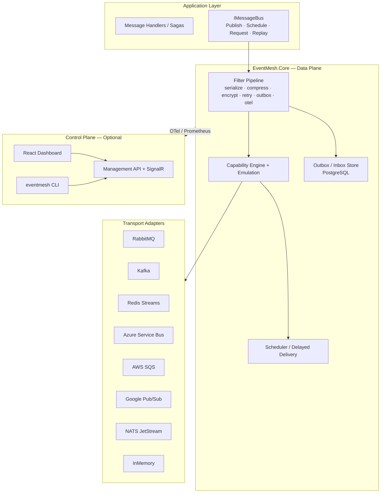
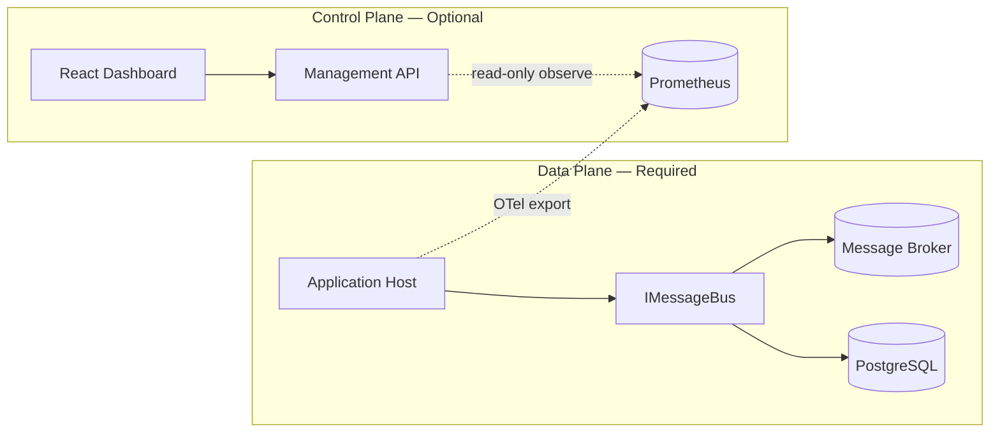
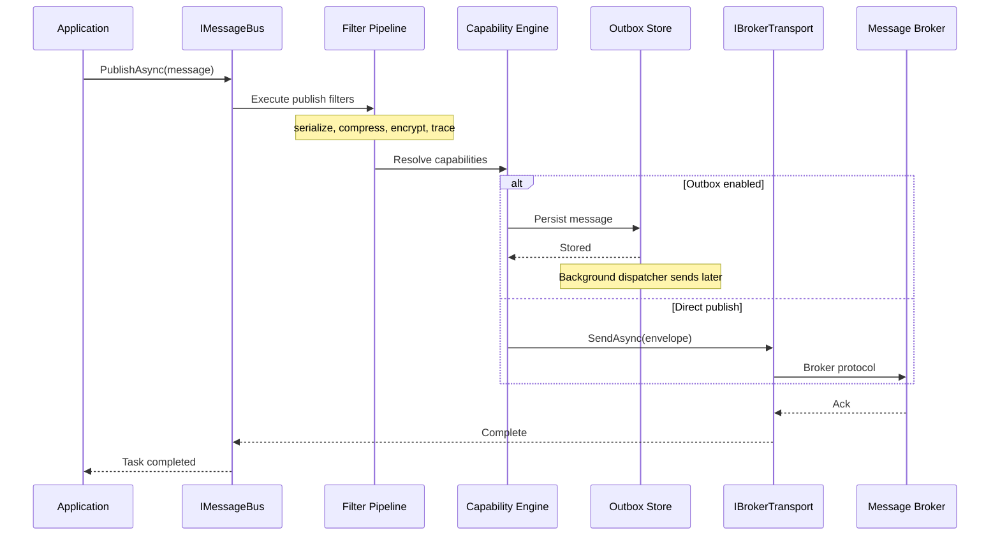
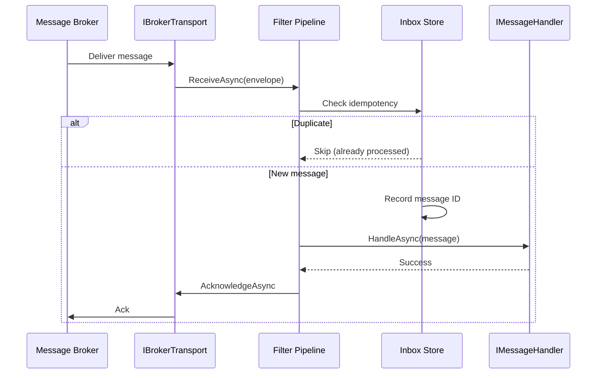
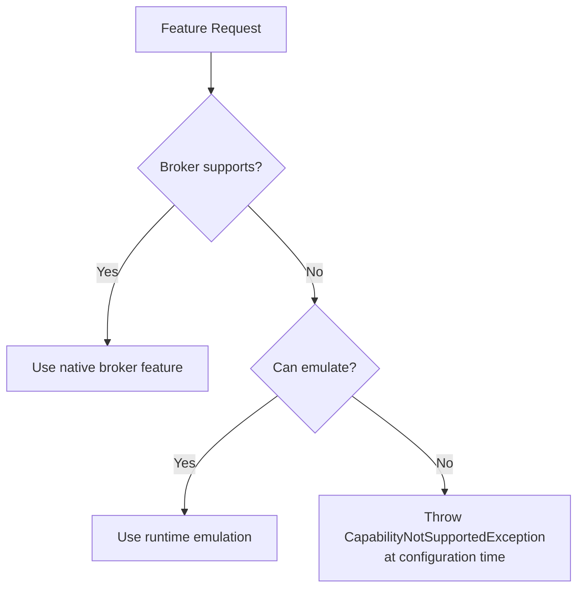
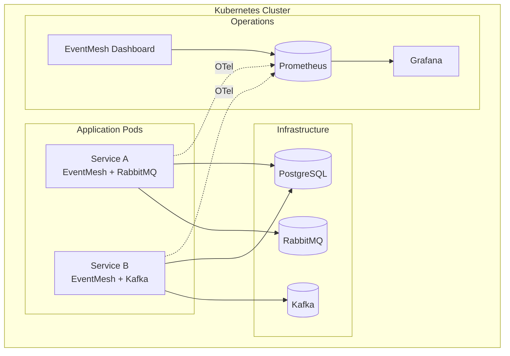

# EventMesh Architecture

This document describes the system architecture of EventMesh: layering, data plane vs control plane, message flow, reliability patterns, and extension points.

**Target framework:** .NET 10 (`net10.0`)

## Design Goals

1. **Broker independence** — Application code depends only on `IMessageBus`; transport selection is configuration
2. **Capability transparency** — Missing broker features are emulated where safe; unsupported features fail at configuration time
3. **Production reliability** — Outbox/inbox, retries, dead-letter queues, and idempotent consumers are first-class
4. **Observability by default** — Every operation emits traces, metrics, and structured logs
5. **Optional control plane** — Management UI and API are separate; applications never depend on them

## High-Level Overview



## Layering

EventMesh follows strict package layering to keep dependencies minimal and transports swappable.

```mermaid
flowchart BT
    subgraph L0 [Layer 0 — Contracts]
        Abstractions["EventMesh.Abstractions<br/>zero dependencies"]
    end

    subgraph L1 [Layer 1 — Runtime]
        Core[EventMesh.Core]
        StoragePG[EventMesh.Storage.PostgreSql]
        StorageRedis[EventMesh.Storage.Redis]
        Schema[EventMesh.SchemaRegistry]
        Security[EventMesh.Security]
    end

    subgraph L2 [Layer 2 — Transports]
        T1[EventMesh.Transport.RabbitMQ]
        T2[EventMesh.Transport.Kafka]
        T3[EventMesh.Transport.RedisStreams]
        T4[EventMesh.Transport.AzureServiceBus]
        T5[EventMesh.Transport.AmazonSqs]
        T6[EventMesh.Transport.GooglePubSub]
        T7[EventMesh.Transport.Nats]
        T8[EventMesh.Transport.InMemory]
    end

    subgraph L3 [Layer 3 — Tooling]
        Mgmt[EventMesh.Management.Api]
        Cli[EventMesh.Cli]
        PluginSdk[EventMesh.Plugin.Sdk]
    end

    Core --> Abstractions
    StoragePG --> Abstractions
    StorageRedis --> Abstractions
    Schema --> Abstractions
    Security --> Abstractions
    T1 & T2 & T3 & T4 & T5 & T6 & T7 & T8 --> Abstractions
    T1 & T2 & T3 & T4 & T5 & T6 & T7 & T8 --> Core
    Mgmt --> Core
    Cli --> Core
    PluginSdk --> Abstractions
```



| Package | Responsibility | Depends On |
|---------|----------------|------------|
| `EventMesh.Abstractions` | Public contracts: `IMessageBus`, `IBrokerTransport`, envelope, capabilities, filters | Nothing |
| `EventMesh.Core` | Pipeline, capability engine, serialization, retry, scheduling, DI extensions | Abstractions |
| `EventMesh.Transport.*` | Broker-specific send/receive/topology | Abstractions, Core |
| `EventMesh.Storage.PostgreSql` | Outbox, inbox, scheduler persistence | Abstractions |
| `EventMesh.Storage.Redis` | Optional cache and distributed locks | Abstractions |
| `EventMesh.SchemaRegistry` | Schema versioning and compatibility | Abstractions |
| `EventMesh.Security` | Encryption, authentication plugins | Abstractions |
| `EventMesh.Management.Api` | Control plane REST API and SignalR | Core |

See [ADR-0001: Layering](docs/adr/0001-layering.md) for the rationale.

## Data Plane vs Control Plane



**Data plane** components run inside the application process. They handle message publish, consume, retry, outbox dispatch, and broker communication. No HTTP server is required for messaging.

**Control plane** components (`EventMesh.Management.Api`, dashboard, CLI) provide operational visibility: connection health, queue depths, dead-letter inspection, replay triggers, and plugin management. Applications export telemetry to the control plane but never call it on the hot path.

See [ADR-0008: Control Plane vs Data Plane](docs/adr/0008-control-plane-vs-data-plane.md).

## Message Flow

### Publish Path



### Consume Path



## Filter Pipeline

Publish and consume operations flow through composable middleware filters (MassTransit-style). Built-in filters include:

| Filter | Phase | Purpose |
|--------|-------|---------|
| Serialization | Both | CloudEvents envelope encoding/decoding |
| Compression | Both | gzip/zstd payload compression |
| Encryption | Both | AES-GCM payload encryption |
| Retry | Consume | Exponential backoff with jitter |
| Outbox | Publish | Transactional outbox persistence |
| Inbox | Consume | Idempotent deduplication |
| OpenTelemetry | Both | Distributed tracing (messaging semantic conventions) |
| Metrics | Both | `System.Diagnostics.Metrics` counters and histograms |

Plugins register additional filters via `IEventMeshPlugin`. See [ADR-0003: Pipeline Architecture](docs/adr/0003-pipeline-architecture.md).

## Capability Engine

Each transport declares a `BrokerCapabilities` flags enum at registration time. The capability engine:

1. **Passes through** when the broker natively supports a feature
2. **Emulates** when a safe alternative exists (e.g., PostgreSQL scheduler for delayed delivery on Kafka)
3. **Rejects at configuration** when emulation is impossible (e.g., replay on AWS SQS)



See [ADR-0002: Capability Model](docs/adr/0002-capability-model.md) and the [Broker Capability Matrix](docs/broker-capability-matrix.md).

## CloudEvents Envelope

All messages use [CloudEvents 1.0](https://cloudevents.io/) as the canonical wire format:

- `id` — unique message identifier (used for inbox deduplication)
- `source` — publishing application or service
- `type` — CLR type name or custom event type
- `time` — UTC timestamp
- `datacontenttype` — serializer content type
- Extension attributes for correlation ID, causation ID, retry count, and scheduling metadata

Transports use structured mode (JSON body) or binary mode (metadata in headers) depending on broker conventions. See [ADR-0004: CloudEvents Envelope](docs/adr/0004-cloudevents-envelope.md).

## Reliability Patterns

### Transactional Outbox

When outbox is enabled, messages are persisted to PostgreSQL in the same transaction as application state changes. A background dispatcher reads pending outbox entries and publishes them to the broker, guaranteeing at-least-once delivery even if the broker is temporarily unavailable.

### Idempotent Inbox

Consumers record processed message IDs in an inbox table. Duplicate deliveries (from broker redelivery or consumer restarts) are acknowledged without re-executing handlers.

### Retry and Dead Letter

Failed handler executions trigger configurable retry policies (exponential backoff with jitter). After max retries, messages move to a dead-letter queue — either a broker-native DLQ or a conventionally named error destination.

See [ADR-0005: Reliability](docs/adr/0005-reliability.md).

## Observability

Every filter emits:

- **Traces** — OpenTelemetry spans following [messaging semantic conventions](https://opentelemetry.io/docs/specs/semconv/messaging/)
- **Metrics** — Published, consumed, failed, retried, and dead-lettered message counters; publish/consume latency histograms
- **Logs** — Structured logs with correlation ID, causation ID, message ID, and broker metadata

Correlation and causation IDs propagate through CloudEvents extension attributes across service boundaries.

See [ADR-0006: Observability-First](docs/adr/0006-observability-first.md).

## Plugin System

Plugins are NuGet packages implementing `IEventMeshPlugin` with a semver-versioned manifest. Registration:

```csharp
builder.Services
    .AddEventMesh()
    .AddPlugin<GzipCompressionPlugin>()
    .AddPlugin<AesGcmEncryptionPlugin>();
```

The dashboard and CLI discover plugins from a configured directory via `AssemblyLoadContext` scanning.

See [ADR-0007: Plugin System](docs/adr/0007-plugin-system.md).

## Storage

| Store | Technology | Purpose |
|-------|------------|---------|
| Outbox / Inbox / Scheduler | PostgreSQL (Dapper/Npgsql) | Transactional message persistence, delayed delivery, idempotency |
| Cache / Locks | Redis (optional) | Distributed locks, consumer offset cache, rate limiting |
| Schema Registry | PostgreSQL | Event schema versions and compatibility checks |

PostgreSQL is accessed via Dapper on the hot path (no EF Core) for minimal allocation and predictable latency.

## Testing Strategy

| Layer | Approach |
|-------|----------|
| Unit | xUnit + FluentAssertions + Moq for pipeline, capability engine, serialization |
| Integration | Testcontainers for PostgreSQL, RabbitMQ, Kafka, Redis, NATS, LocalStack |
| Compatibility | Shared contract test suite; every transport adapter must pass |
| Performance | BenchmarkDotNet with published results per release |
| Chaos | Network partition and broker failure injection (Milestone 15) |
| E2E | Playwright for dashboard (Milestone 10) |

## Deployment Topology



Local development uses `docker/docker-compose.yml`. Production deployment artifacts (Helm, Kubernetes manifests, Terraform) ship in Milestone 15.

## Architecture Decision Records

| ADR | Title |
|-----|-------|
| [0001](docs/adr/0001-layering.md) | Layering |
| [0002](docs/adr/0002-capability-model.md) | Capability Model with Emulation |
| [0003](docs/adr/0003-pipeline-architecture.md) | Pipeline Architecture |
| [0004](docs/adr/0004-cloudevents-envelope.md) | CloudEvents Envelope |
| [0005](docs/adr/0005-reliability.md) | Reliability (Outbox/Inbox/Retry) |
| [0006](docs/adr/0006-observability-first.md) | Observability-First |
| [0007](docs/adr/0007-plugin-system.md) | Plugin System |
| [0008](docs/adr/0008-control-plane-vs-data-plane.md) | Control Plane vs Data Plane |

## Related Documents

- [ROADMAP.md](ROADMAP.md) — Delivery milestones
- [docs/broker-capability-matrix.md](docs/broker-capability-matrix.md) — Broker feature comparison
- [CONTRIBUTING.md](CONTRIBUTING.md) — Development guidelines
