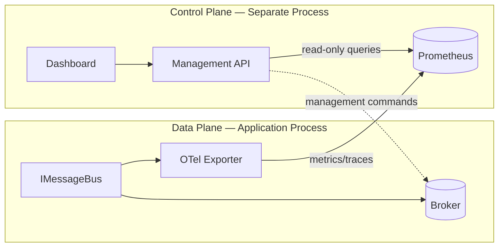

# ADR-0008: Control Plane vs Data Plane

## Status

Accepted

## Date

2026-07-08

## Context

EventMesh includes operational tooling: a management API, React dashboard, and CLI. These tools must provide visibility into messaging health, queue depths, dead letters, and replay operations.

A common anti-pattern in messaging frameworks is coupling the runtime library to a management server, requiring applications to host or connect to a central server for basic publish/consume operations. This creates:

- Deployment complexity (every app needs server connectivity)
- Availability coupling (management server outage affects messaging)
- Security surface expansion (management API exposed on application hosts)
- Version lock-in between runtime and management components

## Decision

EventMesh strictly separates the **data plane** (messaging runtime) from the **control plane** (operations tooling).

### Data plane

Components that handle message flow, running inside the application process:

| Component | Package | Server required? |
|-----------|---------|-----------------|
| Message bus | `EventMesh.Core` | No |
| Transport adapters | `EventMesh.Transport.*` | No (broker only) |
| Outbox/inbox | `EventMesh.Storage.PostgreSql` | No (PostgreSQL only) |
| Pipeline filters | `EventMesh.Core` | No |

The data plane:
- Has no HTTP server dependency
- Operates independently of the control plane
- Exports telemetry (OTel, Prometheus) via standard exporters
- Can be deployed without ever enabling management features

### Control plane

Components that provide operational visibility, deployed separately:

| Component | Package | Purpose |
|-----------|---------|---------|
| Management API | `EventMesh.Management.Api` | REST API for operations |
| SignalR hub | `EventMesh.Management.Api` | Real-time dashboard updates |
| Dashboard | `dashboard/` | React UI for monitoring |
| CLI | `EventMesh.Cli` | Command-line operations |

The control plane:
- Observes the mesh via exported metrics and management topics
- Never sits in the publish/consume hot path
- Is optional — applications function fully without it
- Authenticates operators via OAuth2/OIDC/JWT/API keys (Milestone 15)

### Communication model

- **Telemetry flow:** Data plane exports metrics and traces to Prometheus/OTLP collectors. Control plane reads from collectors (never from the application process directly).
- **Management commands:** Replay, queue inspection, and topology queries go through the management API to the broker directly (read-only or explicitly authorized write operations). They do not route through application processes.
- **No callback:** The data plane never calls the control plane. There is no registration, heartbeat, or service discovery between them.

### Deployment patterns

| Pattern | Data plane | Control plane |
|---------|------------|---------------|
| Minimal | App + broker + PostgreSQL | None |
| Observable | App + broker + PostgreSQL + OTel collector | Prometheus + Grafana |
| Full operations | App + broker + PostgreSQL | Management API + Dashboard + CLI |

## Consequences

### Positive

- Applications are simple to deploy (no management server dependency)
- Control plane can be scaled, secured, and updated independently
- Data plane availability is not affected by control plane outages
- Clear security boundary: production apps don't expose management endpoints

### Negative

- Control plane has limited visibility into in-process state (pipeline filter metrics require OTel export)
- Management commands (replay, purge) operate at the broker level, not per-application-instance
- Two deployment artifacts to manage in full-operations mode

### Neutral

- Applications can optionally expose Prometheus metrics endpoint for local scraping
- Future: control plane agent sidecar pattern for per-instance visibility (not in initial scope)

## References

- [ARCHITECTURE.md](../../ARCHITECTURE.md)
- [ADR-0001: Layering](0001-layering.md)
- [ADR-0006: Observability-First](0006-observability-first.md)
